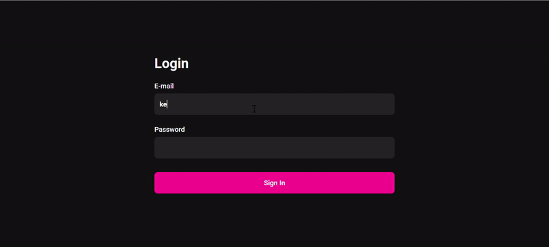
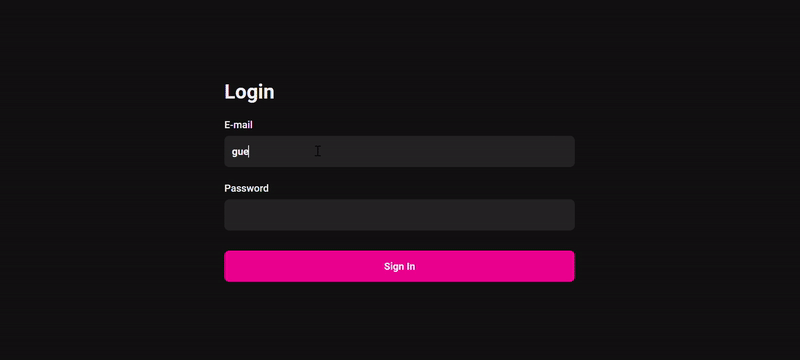

# Authentication and Authorization using Next.js

This application contains authentication and authorization system (sign in, sign out, permissions to routes)
 

# Overview 🎥

User with permissions

User without permissions

 

# Project 💻

This application uses a Node.js Back-End that has some endpoints and handles the JWT Authentication.

About:

- Authentication system with Refresh Token strategy;
- Authorization system, which the user needs to have permissions to have access to some routes and components;
- The access to routes and components is controled by client and server side;
- Response interceptor functionality provided by Axios, which I needed to use a strategy of Requests Queue to wait for the token to be refresed, so then, all the requests can continue;
- The token and refresh token returned by the Back-End is saved in the cookies, so the client and server side can have access to it.
- BroadcastChannel API was used for the sign out functionality, so if the user signs out in one window, all the others are also signed out.

# Technologies ⚡

### • ReactJS

### • Typescript

### • Next.js

### • SCSS (SASS)

### • Axios

### • Nookies

### • ApexCharts (to develop the charts)
